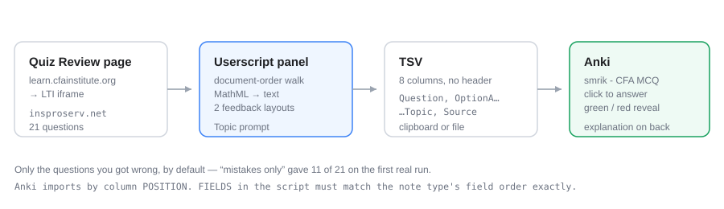

<h1 align="center">cfa-quiz-to-anki</h1>

<p align="center">
  Turn a CFA Institute practice-quiz <strong>Review</strong> page into Anki-ready TSV — in two clicks.
</p>

<p align="center">
  <a href="https://raw.githubusercontent.com/smrik/cfa-quiz-to-anki/main/cfa-quiz-to-anki.user.js"></a>
  
  
  
</p>

<p align="center">
  
</p>

Reviewing a CFA practice quiz tells you which questions you got wrong, then
throws that away. This pulls each one — the vignette if it belongs to an item
set, the question, all three options, the correct letter, the official
explanation, and which answer *you* picked — and hands you a TSV you can import
straight into Anki. Tables, lists and formulas come across intact.

By default it exports **only the questions you got wrong**. On the first real
run that was 11 of 21.

## Install

1. Install [Tampermonkey](https://www.tampermonkey.net/)
2. Open **[cfa-quiz-to-anki.user.js](https://raw.githubusercontent.com/smrik/cfa-quiz-to-anki/main/cfa-quiz-to-anki.user.js)** — Tampermonkey offers to install it
3. Import the note type (see [Anki setup](#anki-setup))

Updates are automatic: `@updateURL` points back at this repo, so a
version-bumped push reaches your browser on Tampermonkey's next check.

## Use

1. Finish a quiz and open its **Review** page
2. A panel appears bottom-right
3. **Copy TSV — mistakes only** *(recommended)* or **all**
4. Confirm the **Topic** — it is pre-filled from the page, e.g.
   `Quantitative Methods - Module 7: Estimation and Inference`, and fills the `Topic` field.
5. In Anki: **File → Import**

The panel only appears on a Review page. While you are taking a quiz it stays
out of the way.

### Anki setup

The file starts with Anki's own header lines, so the import screen sets itself
up (Anki 2.1.54 or later):

```
#separator:tab
#html:true
#notetype:smrik - CFA MCQ
```

Check the **Deck** and press Import. On an older Anki, set those three by hand.
These `#` lines are settings, not a column-name row — there is still no header
row of field names, because Anki would import one as a note.

Fields are HTML. Formulas are written as `\( ... \)` and rendered by Anki's
built-in MathJax, on desktop and mobile alike.

**Existing notes** defaults to *Update*, matched on the first field
(`Question`). Re-importing a quiz updates the cards you already have instead of
duplicating them — as long as the question text is unchanged. Cards exported by
version 1.x had flattened text, so any of those with a formula, table or
vignette will import as new cards rather than update.

The note type renders an answerable card: click an option on the front, and the
back marks it green if you were right, red if not, and always highlights the
correct one. The explanation and a `Topic — Question N of M` source line sit
below.

> [!IMPORTANT]
> **Anki imports by column *position*.** A header row does not reorder anything
> — which is why this file has none. `FIELDS` in the script must match the note
> type's field order exactly:
>
> ```
> Question, OptionA, OptionB, OptionC, CorrectAnswer, Explanation, Topic, Source
> ```
>
> `Topic` is **seventh**, not first. Get it wrong and every field shifts by one:
> the question renders as option A and nothing makes sense. If you ever reorder
> the note type's fields (*Tools → Manage Note Types → Fields*), update
> `FIELDS` to match.

## Panel

| Button | Does |
|---|---|
| **Copy TSV — mistakes only** | clipboard, wrong answers only |
| **Copy TSV — all** | clipboard, every question |
| **Download .tsv** | saves a file instead |
| **Debug: copy parsed JSON** | full parse plus a `warnings` array — start here when something looks off |

`warnings` reports any question that came back missing a field, so a silent
mis-parse shows up as data rather than as a wrong flashcard three weeks later.
It also fires when the page's own signals disagree about which option is
correct. Each parsed card carries an `evidence` map showing which signals named
the answer: the screen-reader cue, the "Correct Answer:" label, the per-option
feedback, the explanation text, and your score.

The note type is three-option multiple choice. Anything else — the occasional
"Essay" matching question — is skipped, and the status line says how many.

## Companion: readable quiz text

`cfa-quiz-readable.user.js` is a second, independent userscript for *taking*
the quiz rather than reviewing it. The practice tool sets question text at
roughly 1.15 line height and lets it run ~125 characters wide on a large
monitor. The script loosens the line height to 1.6, caps the line length at
80ch (tables and images keep full width) and adds a gap between paragraphs.

Install: open **[cfa-quiz-readable.user.js](https://raw.githubusercontent.com/smrik/cfa-quiz-to-anki/main/cfa-quiz-readable.user.js)**.

Click inside the question first so the quiz frame has keyboard focus, then:

| Keys | Does |
|---|---|
| **Alt+Shift+Up / Down** | line height ±0.05 |
| **Alt+Shift+W** | cycle line length: 80ch, 95ch, 65ch, off |
| **Alt+Shift+R** | toggle on/off |

The same actions, plus *Reset to defaults*, are in the Tampermonkey menu.
Settings persist.

## How the scraping works

The quiz runs inside an LTI iframe (`insproserv.net`) embedded in Canvas
(`learn.cfainstitute.org`), so the script matches both origins — userscripts
run inside frames by default.

Every anchor is semantic or Canvas-stable. The emotion classnames
(`css-1q7flqv`, …) are content hashes that change on every deploy, so nothing
here depends on them.

| Anchor | Carries |
|---|---|
| `[data-quiz-question-id]` | one per question |
| the block's previous sibling | `8 · Multiple Choice · 0 / 1 point` — number, type, score |
| `.user_content` | actual prose — question, each option, each feedback |
| `[class*="screenReaderContent"]` | `Correct answer:` / `Incorrect answer:` / `Not Selected` |
| `input[type=radio]:checked` | the option you picked |
| `<span>Correct Answer:</span>` | labels a repeat of the right option when you were wrong (layout A) |
| `h3` "Feedback" | the explanation block (layout A) |
| `Correct/Incorrect Answer Feedback:` | per-option feedback (layout B) |
| `h4` "Vignette" | an item set; its prose is shared by the questions nested under it |

### Traps, all found on real pages

**1. Two different feedback layouts.** Questions 1–5 use a single
`<h3>Feedback</h3>` block; question 6 onward puts `Correct Answer Feedback:`
inline under every option. Worse, layout A nests per-option feedback *inside*
the option wrapper while layout B puts it in a sibling one level up — so a
depth-based walk cannot handle both. Reading order is identical in both, so the
code walks **document order** instead.

**2. Maths is structure, not characters.** MathJax renders to SVG, so
`textContent` returns nothing; elsewhere the page uses raw `<math>`, whose
`textContent` silently drops the structure — `√0.7436 = 0.8623` came out as
`0.7436 = 0.8623`. Both are converted from MathML to TeX
(`\(\sqrt{0.7436}=0.8623\)`), which Anki renders.

**3. Question numbers restart per section** (1–5, then 1–16), so
`aria-label="Question N Review"` is not unique across the page — and inside an
item set it counts the vignette as a question. The running index is used for
anything that must be unique; the number shown in the header row is kept as
`pageNumber` and used in the `Source` field.

**4. Item sets keep the vignette outside the question.** The exhibit a question
refers to lives in a parent container headed `Vignette`, not in the question
block. It is prepended to the `Question` field in a collapsible
`<details>` block.

**5. Options are shuffled.** The page may show them as A, C, B. They are mapped
to fields by their letter, never by position.

**6. Flattening loses meaning.** Tables, lists and sub/superscripts are kept as
HTML (tables with inline borders, so the card template needs no CSS).

## Development

```powershell
# edit cfa-quiz-to-anki.user.js, then:
./bump.ps1                       # 2.0.0 -> 2.0.1: syntax-check, commit, push
./bump.ps1 -Part minor           # -> 2.1.0
./bump.ps1 -Message "fix maths"  # custom commit message
./bump.ps1 -NoPush               # commit only
./bump.ps1 -File cfa-quiz-readable.user.js   # bump the readable-text script instead
```

`bump.ps1` runs a Node syntax check **before** committing. A broken script
pushed to `main` would otherwise propagate silently to the browser on the next
auto-update.

Three things that bite:

- **The version must increase.** Tampermonkey compares `@version`; pushing new
  code under the same number is a silent no-op. That is what `bump.ps1` is for.
- **Updates are not instant.** Tampermonkey checks on its own schedule, daily by
  default. Force one from its dashboard → *Installed userscripts* → ⟳, or
  *Utilities → Check for userscript updates*.
- **`raw.githubusercontent.com` caches for ~5 minutes**, so a push is not
  visible at the raw URL straight away.

The repo has to stay **public** — Tampermonkey fetches the raw URL
unauthenticated.

## Screenshots

Not included yet. To add: drop PNGs in `docs/` and reference them here —

```markdown


```

Worth capturing: the panel over a Review page, and one imported card
front-and-back.

## License

MIT
